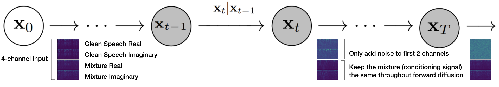

# This is the official codebase and example hosting for the "Clarity or Confusion: The Double-Edged Sword of Diffusion-based Speech Enhancement" paper.

## Orangization:
- images: contains images used in the readme and other potentially interesting figures
- audio: contains samples used in the readme
- code: contains the code used for training along with a simple jupyter notebook that can be used for inference

## Speech Enhancement Examples

Easy Examples:
 

Difficult Examples:

Hallucination Examples: